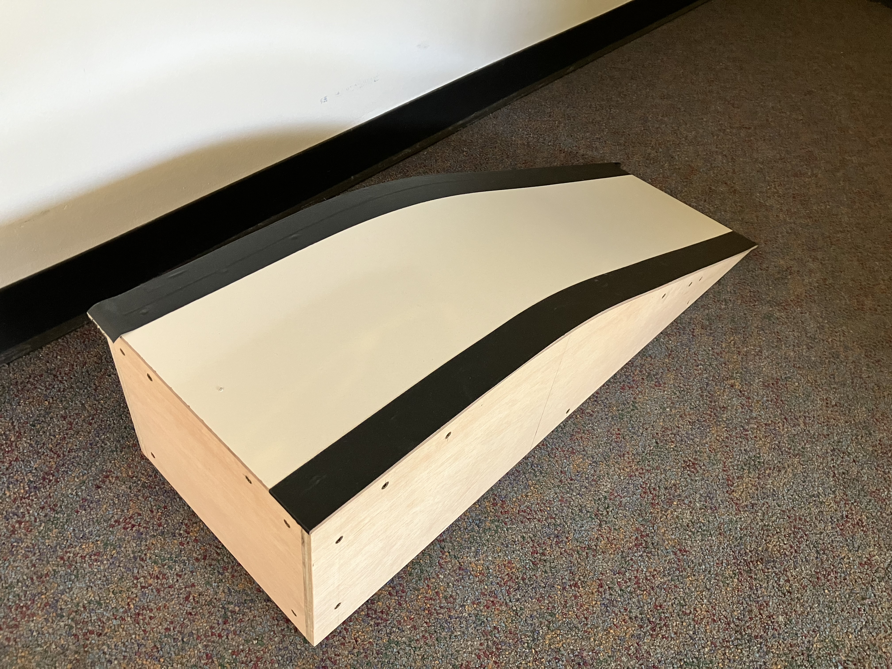

# 8 Hill Climb

The purpose of this exercise is to program the Pololu robot to execute a specified task, namely to climb a ramp, detect when it reaches the top, turn around, and drive back down the ramp, all without falling off the edge of the ramp.

For this lab, you will need a suitable ramp like the one here:

This is pretty fancy one, but the key elements that you need are easy to construct from reasonably stiff cardboard. The key properties it needs are:

1. A sloped surface for the robot to climb with a roughly 15 degree slope.
2. A flat surface on top for the robot to turn around.
3. A light-colored surface.
4. Dark colored edges that the robot can detect to not drive off the edge.

The ramp shown above is about 4 feet long and 1.5 feet wide.

## 8.1 Prelab

1. Read through the subsequent sections of this lab and state all of the requirements that your robot program must satisfy. 

2. Review [Section 6.5, Line and bump sensors](https://www.pololu.com/docs/0J86/6.5) of the [Pololu 3pi+ 2040 robot User's Guide](https://www.pololu.com/docs/0J86). How do the line sensors work?  Is it possible to use the line sensors in combination with the bump sensors?

3. Recall from the [Sensors](./Sensors.md) lab that you used an accelerometer to measure pitch and roll of the robot. Assume you have a measurement _p_ of pitch and _r_ of roll. If the robot is sitting on a ramp and its _x_ axis is pointing straight down the hill, then what values should you see for _r_?  What should the sign of _p_ be (assuming the angle is given in the range -&pi;/2 to &pi;/2)?
You will use feedback control and adjust the wheel speeds to make _r_ approach the desired value. 

## 8.2 Cliff Sensing

For the hill-climbing exercise, your task is ultimately to get the robot to climb a ramp. So as to not damage the robot, you need to be sure that it will not drive off the edge of the ramp. Your first task, therefore, is to get the robot to take evasive action when it encounters the edge of the ramp.

Robots that navigate in the real world, such a Roomba vacuum cleaning robot, typically
include "cliff sensors," which detect when the edge of the robot hangs over an empty space,
for example at the top of a stairway.
These are often implemented with ultrasonic distance sensors pointing down.
The Pololu robot has infrared reflectivity sensors that can detect such cliffs (open space below the robot does not reflect infrared light), but to be even safer, your ramp can be equipped with dark bands on the edges as shown in the figure above.
Your task now is to program the robot to identify when its front end is above one of these bands and have it stop.

First, you will get familiar with the reflectivity sensors.
Then you will use them.

**NOTE:** According to [Section 6.5, Line and bump sensors](https://www.pololu.com/docs/0J86/6.5) of the [Pololu 3pi+ 2040 robot User's Guide](https://www.pololu.com/docs/0J86), it is not practical to use the bump sensors in combination with the line sensors. Hence, in this lab, you will only use the line sensors.
