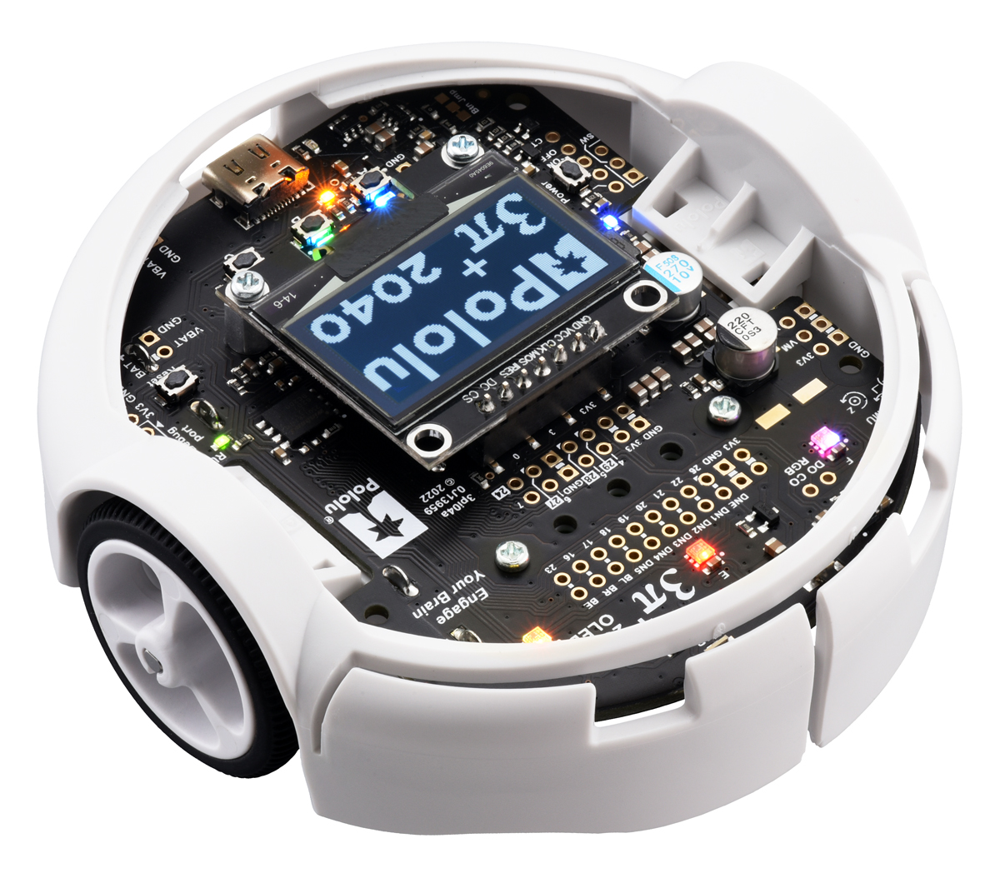

# Notes for Instructors
If you are teaching an embedded systems course and would like to use this material, please feel welcome to do so. This page provides resources for preparing a lab based on the software and hardware used in this lab manual.

## Lingua Franca
These labs rely heavily on the use of [Lingua Franca (LF)](https://lf-lang.org/), an [open-source](https://repo.lf-lang.org/)
coordination language for designing and building systems that feature
concurrency, may be reactive and/or time-sensitive, and may be distributed. It
integrates seamlessly with existing target languages, including C, C++, Python,
Rust, and TypeScript, and the C target is particularly suited for programming
embedded systems. LF provides a component-based design methodology that allows
programmers to take full advantage of existing manufacturer-supplied SDKs and
legacy software while it equips programmers with powerful abstractions for
specifying concurrent and timed system behavior.

Writing concurrent software that behaves deterministically and in accordance
with timing requirements is a difficult an error-prone task when done using
low-level primitives like threads, interrupts, and hardware timers. Lingua
Franca provides syntax for defining and composing concurrent components called
reactors, which react to events deterministically, supported by a dynamic
runtime scheduling engine. While reactions to events can perform low-level
interactions with the hardware (for example, to access a sensor or drive an
actuator), this logic is entirely independent from the orchestration of
interactions with other software components, which is taken care of
automatically by the Lingua Franca runtime system. This approach facilitates
building complex systems out of simple components and provides a more
disciplined approach to system design.

## The Pololu 3Pi+ 2040 Robots
The Pololu robot used in these labs is available for purchase [here](https://www.pololu.com/category/300/3pi-plus-2040-robot). The 3pi+ 2040 is a versatile, high-performance, user-programmable robot that measures just 9.7 cm (3.8") in diameter. At its heart is a Raspberry Pi RP2040 microcontroller (like the one on the [Raspberry Pi Pico](https://www.raspberrypi.com/products/raspberry-pi-pico/)), a 32-bit dual-core Arm Cortex-M0+ processor running at 125 MHz.

The robot is available as a kit or pre-assembled, and comes in different motor configurations:
* **30:1 MP 6V Micro Metal Gearmotors** (Standard Edition, _used in this lab_)
  - up to 1.5 m/s; offer a good combination of speed and controllability
* **75:1 LP 6V Micro Metal Gearmotors** (Turtle Edition)
  - up to 0.4 m/s; allow for longer battery life
* **15:1 HPCB 6V Micro Metal Gearmotors** (Hyper Edition)
  - up to 4 m/s; difficult to control, easy to damage

For more information, refer to the [docs provided by Pololu](https://www.pololu.com/docs/0j86).

## The Ramp used for the Hill Climb
Build instructions for a ramp to use with the [Hill Climb](Hill.html) exercise will be posted here soon. The robots are very light-weight, however, so even a very flimsy ramp constructed using cardboard will probably do.
