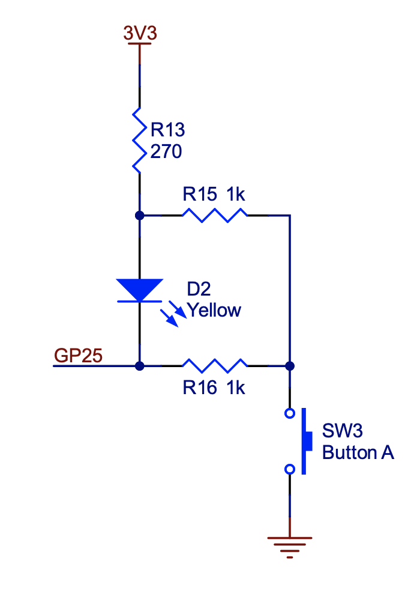

# 5. Peripherals and Memory-Mapped I/O

<style type="text/css">
    ol ol { list-style-type: lower-alpha; }
</style>

The purpose of this lab exercise is to learn how sensors and actuators are connected to a microcomputer and how the memory system abstraction is used to access and control the hardware.
In the previous labs, you accessed peripheral devices (an LED and an accelerometer) using GPIO and the I<sup>2</sup>C bus, respectively.
In this lab, we will demystify the SDK functions that were called to access these devices.

For background, review Chapter 9 (Memory Architectures) of <a href="https://leeseshia.org">Lee and Seshia</a>.
The particular chip on the [Pololu 3pi+ 2040 robot](https://www.pololu.com/docs/0J86) is a [Raspberry Pi RP2040](https://en.wikipedia.org/wiki/RP2040).
The [RP2040 Datasheet](https://datasheets.raspberrypi.com/rp2040/rp2040-datasheet.pdf) is the definitive reference for this chip.
Sections 2.2 (Address Map) will be particularly useful for this lab, but the datasheet can be daunting. The source code for SDK can also be a valuable reference. 

On the RP2040, peripheral devices are accessed via one of three on-chip busses called AHB (Advanced High-performance Bus), APB (Advanced Peripheral Bus), and IOPORT.
APB is used for lower-speed peripherals, AHB for higher speed peripherals, and IOPORT for single-cycle I/O (SIO) peripherals, the highest speed.

## 5.1 Prelab

1.  The I<sup>2</sup>C bus on the RP2040 is accessed by reading and writing memory addresses begining at 0x40044000. Does this use AHB, APB, or IOPORT?

    **Note:** To determine the starting address 0x40044000, a careful reading of section 2.2, Address Map, of the [RP2040 Datasheet](https://datasheets.raspberrypi.com/rp2040/rp2040-datasheet.pdf) reveals that the SDK defines a macro `I2C0_BASE` with value 0x40044000.  Alternatively, you can use the search mechanism of your IDE (e.g. VS Code) to trace the source code.  The `Accelerometer` reactor defined in the `src/lib/IMU.lf` file invokes a function called `imu_read_acc`.  Searching for this function definition reveals it in `robot-lib/src/imu.c`. Examining the source code reveals that it references a variable `i2c0`. Searching for this reveals that is a macro defined in `pico-sdk/src/rp2_common/hardware_i2c/include/hardware/i2c.h` that refers to `i2c0_inst`, which in turn refers to `i2c0_hw`, which in turn refers to `I2C0_BASE`.  Finally, that latter macro is defined in `pico-sdk/src/rp2040/hardware_regs/include/hardware/regs/addressmap.h` as follows:
    
    ```
    #define I2C0_BASE _u(0x40044000)
    #define I2C1_BASE _u(0x40048000)
    ```
    
    This sort of detective work, albeit tedious, can be invaluable when determining how things actually work.
    
2.  To understand how a program interacts with hardware, it is important to understand exactly how the C language uses pointers.

    1. Which of the following code snippets reads the value of a 32-bit register at address 0x40001000 into a variable named foo?
        ```
        // (1)
        uint32_t *load = (uint32_t) 0x40001000;
        uint32_t foo = load;
    
        // (2)
        uint32_t *load = (uint32_t *) 0x40001000;
        uint32_t foo = *load;
    
        // (3)
        uint32_t load = (uint32_t) 0x40001000;
        uint32_t foo = load;
        ```
        
    2. Which of the following code snippets writes the value 5 to the address 0x4000600F?
    
        ```
        // (1)
        uint32_t *store = (uint32_t *) 0x4000600F;
        store = 5;
    
        // (2)
        uint32_t store = (uint32_t) 0x4000600F;
        store = 5;
    
        // (3)
        uint32_t *store = (uint32_t *) 0x4000600F;
        *store = 5;
        ```
        
\end{lstlisting}
\begin{solution}
    \begin{lstlisting}
    uint32_t *store = (uint32_t *) 0x4000600F;
    *store = 5;
    \end{lstlisting}
\end{solution}


3.  The `src/Blink.lf` example provided to you calls a function `gpio_put` with two arguments, `PICO_DEFAULT_LED_PIN` (which has value 25 for the Pololu robot) and true or false to turn the LED on or off.  That function is defined in the SDK as follows:

    ```
    static inline void gpio_put(uint gpio, bool value) {
        uint32_t mask = 1ul << gpio;
        if (value)
            gpio_set_mask(mask);
        else
            gpio_clr_mask(mask);
    }
    ```
    
    The functions `gpio_set_mask` and `gpio_clr_mask` are defined as follows:
    
    ```
    static inline void gpio_set_mask(uint32_t mask) {
        sio_hw->gpio_set = mask;
    }
    static inline void gpio_clr_mask(uint32_t mask) {
        sio_hw->gpio_clr = mask;
    }
    ```
    
    A bit of detective work (Section 2.3.1.7, List of Registers, of the [RP2040 Datasheet](https://datasheets.raspberrypi.com/rp2040/rp2040-datasheet.pdf) or writing a program that prints the values) reveals the following values:
    
    ```
    PICO_DEFAULT_LED_PIN: 25
    sio_hw: 0xd0000000
    &sio_hw->gpio_set: 0xd0000014
    &sio_hw->gpio_clr: 0xd0000018
    ```
    
    1. Which bus, AHB, APB, or IOPORT, is used to control the GPIO pin that turns on an off the LED?
    2. Explain the role of `mask` variable in `gpio_put`. Why is its value the same whether you are turning on or off the LED?  How does the hardware recognize whether you intend to turn on or off the LED?
    3. The second argument to `gpio_put` specifies whether to "set" or "clear" the GPIO pin. Setting the pin means bringing its voltage high, whereas clearing it means bringing the voltage low (to ground).  The [3pi 2040 Control Board Schematic](https://www.pololu.com/file/0J1940/3pi-2040-control-board-schematic.pdf) reveals that GPIO pin 25 is connected on the robot as follows:

        
        
         Should you set or clear the GPIO pin to turn on the LED?  What do you expect will happen when you push button A?

## 5.2 Controlling GPIO through Memory Mapped I/O

An SDK like the Pico SDK is convenient and enables you to write code that can be more easily ported to different hardware.  In particular, this SDK includes a board-dependent header file that defines specific variables for a variety of boards that all use the same RP2040 processor.  For the Pololu 3pi+ 2040 robot, for example, the fact that GPIO pin 25 is connected to the yellow LED is defined in a header file `pololu_3pi_2040_robot.h`.

But using an SDK also hides what is really happening in the hardware.  In this exercise, you are to rewrite part of the `src/Blink.lf` application to write directly to memory addresses without using SDK functions.  In particular, replace the reaction to the timer so that instead of using the SDK function `gpio_put`, your code writes directly to memory addresses that you specify.

You could similarly replace the reaction to the `startup` event, but that turns out to be fairly tedious and doesn't lend much additional insight, so we do not recommend doing that.

Note that this exercise reveals why we are using the C programming language and a bare-metal target processor.  Higher-level languages like Python and operating systems like Linux do not allow such direct manipulation of hardware.

## 5.3.  Polling Input

A GPIO pin can serve as an input or an output. As shown in the schematic above, GPIO pin 25 is connected to Button A on the robot as well as to the LED.  Your task is to create a Lingua Franca program that reads the state of this pin every 250ms to determine whether the button is being pushed or not.  Since you cannot use the GPIO pin simultaneously as an input and output, we suggest importing the library reactor `lib/Display.lf` and using the LCD display on the robot to display the state of the button rather than trying to drive the LED.

The style of input where you periodically query the state of peripheral hardware is called "polling". What are some advantages and disadvantages of polling?
In the next lab, we will investigate a more reactive technique that uses interrupts.

## 5.4.  Postlab

1. Address 0xd000001c is defined in Section 2.3.1.7, List of Registers, of the [RP2040 Datasheet](https://datasheets.raspberrypi.com/rp2040/rp2040-datasheet.pdf) as `GPIO_OUT_XOR` or "GPIO output value XOR."  Writing a mask to this address will, in one cycle, reverse the polarity of the GPIO pin; if it is set, it will be cleared, and if it is cleared, it will be set. Why do you think the hardware designers chose to provide this functionality?  If this functionality were not available, how would you reverse the polarity of a pin?  Is there a risk that your alternative solution would not cause anything to change on the pin?

2. You need to change the state of two GPIO pins, and you want them to change at the same time - closer together in time than the clock period of the processor. To accomplish this, you try to write both of their corresponding bits in the GPIO OUT register in the same write function.
Do you think this will cause both pins to switch at the same time? Why or why not?

3. The `mask` functionality explored in this lab may seem a bit unusual. Suppose that instead of providing a mask, when you want to change the state of a GPIO pin you had to write a single 32 bit number to a memory-mapped register, where the value you write specifies the state of **all** the GPIO pins.  What would be the potential pitfalls of such a mechanism?

4. What were your takeaways from the lab? What did you learn during the lab? Did any results in the lab surprise you?