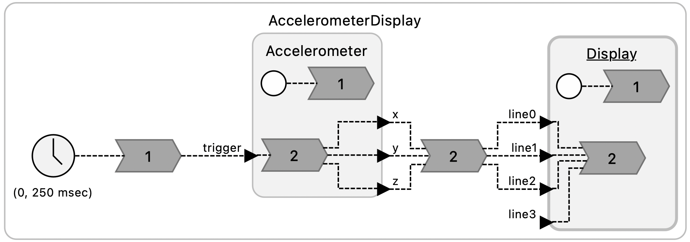

# Interfacing with Sensors

The purpose of this exercise is to learn to read sensor values on a microcontroller and to interpret those values. You will read accelerometer data from a device on the Pololu robot, convert the readings to meaningful units, and use the results to estimate the tilt of the surface on which the robot sits. As a side effect, you will gain experience reading a technical datasheet.

The Pololu robot includes an inertial measurement unit (**IMU**) made by ST Microelectronics, part number LMS6DSO, which includes an accelerometer and a gyroscope. In this lab, we will focus on the accelerometer.

On the robot, the IMU is connected to the RPi via the [I<sup>2</sup>C](https://en.wikipedia.org/wiki/I²C) bus, a serial communication bus that is widely used to connect lower speed peripheral chips to microprocessor chips.

Part of the purpose of this exercise is to learn to work from incomplete documentation, an inevitable reality in any engineering project. It takes a certain amount of detective work to identify properties of the hardware you are working with that may be important in your application.

## Prelab

### References

* Chapter 7, Sensors and Actuators, of [Lee and Seshia](https://leeseshia.org)
* [ST LMS6DSO inertial module datasheet](https://www.pololu.com/file/0J1899/lsm6dso.pdf)

### Questions

<style type="text/css">
    ol ol { list-style-type: lower-alpha; }
</style>

1. Reading a datasheet.
    1. The output data rate (**ODR**) is determined by a register on the IMU chip called `CTRL1_XL`. On the Pololu robot, the `CTRL1_XL` register is set to [hexadecimal](https://en.wikipedia.org/wiki/Hexadecimal) value 0x30 (0b00110000 in binary) during initialization of the robot (by writing to the I<sup>2</sup>C bus).  What is the ODR rate that this specifies?
    
        **Hint:** Section 9.12 of the [inertial module datasheet](https://www.pololu.com/file/0J1899/lsm6dso.pdf) describes the `CTRL1_XL` accelerometer control register.
        
    2. The accelerometer on the robot can be configured to have one of four **ranges** by setting the `CTRL1_XL` register.  Each range is a multiple of _g_, the acceleration due to gravity at the earth's surface, defined to be 9.80665 m/s<sup>2</sup>. What are the ranges supported by the accelerometer on the IMU chip?

    3. The robot software configures the accelerometer hardware to use one of these four ranges during initialization. What is this range?         

    4. The IMU chip offers an optional low pass filter (**LPF**) that performs additional smoothing of the signal from the accelerometer at the cost of additional latency. By default, the robot initializes the IMU to not use this filter. What value would you set the `CTRL1_XL` register to to use the filter and leave the ODR and range as above?  

2. Interpreting sensor data
    1. According to table 2 of the [inertial module datasheet](https://www.pololu.com/file/0J1899/lsm6dso.pdf), with the default range, the **sensitivity** of the accelerometer is 0.061 mg/LSB. Here, mg stands for milli-g's and **LSB** for least significant bit. The accelerometer has a 16-bit analog to digital converter (**ADC**). Reading its raw data over the I<sup>2</sup>C bus yields a 16-bit signed integer. Explain where the number 0.061 comes from.
    
        **Note:** The `robot-lib` library provides a convenience function `imu_read_acc` that reads accelerometer data into an array of floats, which it converts into units of _g_. Hence, when using this library, you will not need to deal with the complexities of interpreting the raw binary output of the accelerometer. But understanding the sensitivity is still important.

    2. As explained in Chapter 7, Sensors and Actuators, of [Lee and Seshia](https://leeseshia.org), a sensor output may be modeled by an affine function _f_(_x_) = _ax_ + _b_, where _a_ is the sensitivity and _b_ is the bias.  For this IMU, ideally, if _x_ is the 16 bit integer received over the I<sup>2</sup>C bus, _a_ = 0.000061, and _b_ = 0, then _f_(_x_) is the acceleration in _g_'s.  But both _a_ and _b_ may vary with temperature. How much variation  in _a_ should you expect (in percent per degree centigrade)?  How much bias can you expect (in _mg_)?  How much should you expect the bias to change with temperature (in _mg_ per degree centigrade)?

        **Hint:** Table 2 could be helpful. Bias is referred to as "zero-g level" in this table.
        
## Sampling an Accelerometer

The goal of this lab is to calculate and display the inclination of the Pololu robot. The inclination is the amount of tilt of the surface on which the robot sits. As explained in chapter 2 of [Lee and Seshia](https://leeseshia.org), **pitch** is the angle deviation from horizontal of a straight line coming out of the front of the robot. **Roll** is the angle deviation from horizontal of a straight line going directly through the wheels.  The third angle in that chapter, **yaw**, is not a measure of inclination. We will seek instead a **tilt**, the angle deviation from vertical of a straight line emerging from the top of the robot. The tilt angle can be calculated from the pitch and roll angles, which in turn can be calculated from the _x_, _y_, and _z_ acceleration measures. See [Using an Accelerometer for Inclination Sensing](https://www.analog.com/en/app-notes/an-1057.html), by Christopher J. Fisher.

To help you get started, a sample Lingua Franca program `AccelerometerDisplay.lf` is provided. To try out the program, plug your robot into the USB port of your host computer and put it in BOOTSEL mode by holding the B button while pressing the reset button.  In the root directory of your clone of the lf-pico repo, compile and load the program onto the robot:

```
$ lfc src/AccelerometerDisplay.lf
$ picotool load -x bin/AccelerometerDisplay.elf
```

You should see the display light up looking something like this:


1. Interpreting the numbers
    1. Explain why, when the robot is sitting on a flat surface, the sensed accelerations in the _x_ and _y_ directions are near zero and in the _z_ direction near one.
    2. Why is the _z_ direction not near negative one? Doesn't grativation pull you down, not up?
    
    Experiment with rotating the robot and observing how the three measured accelerations change.
    
    **CHECKOFF:** Demonstrate the app working on all three axes.

2. Examine the LF program
    1. Open the file `src/AccelerometerDisplay.lf` in VS Code. Enable the diagram so that you see this:

        

3. Convert the display to show tilt in degrees rather than _g_ force acceleration.
    1. x