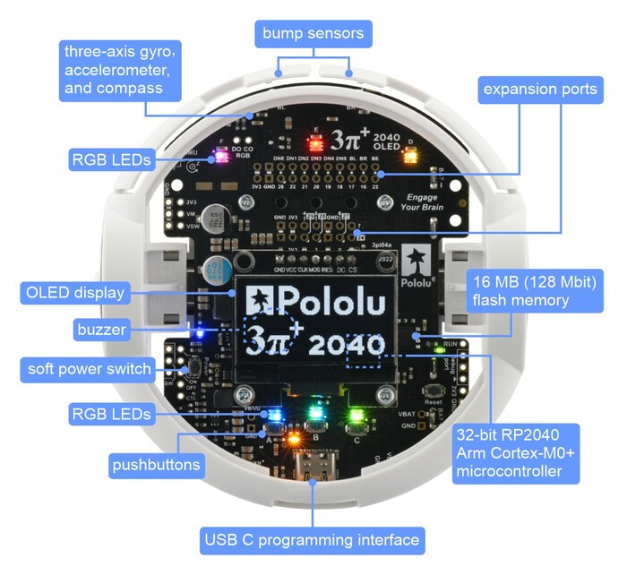
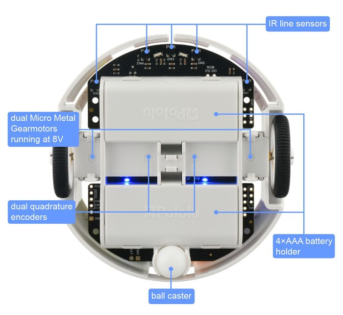
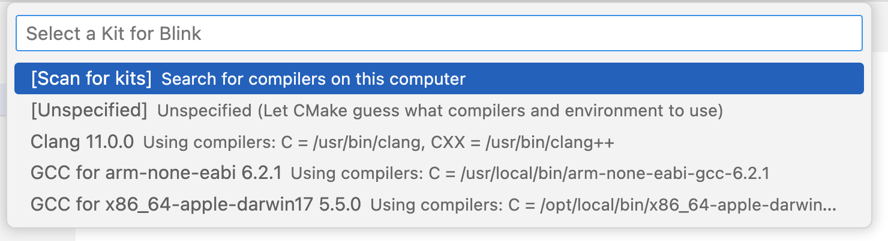
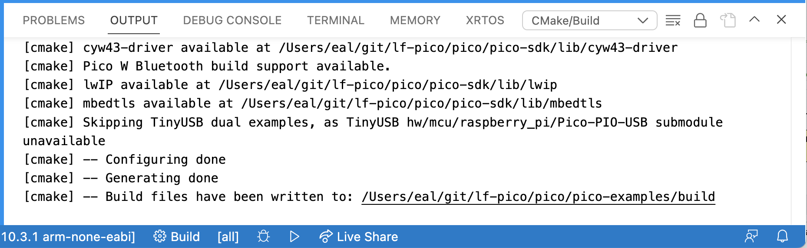
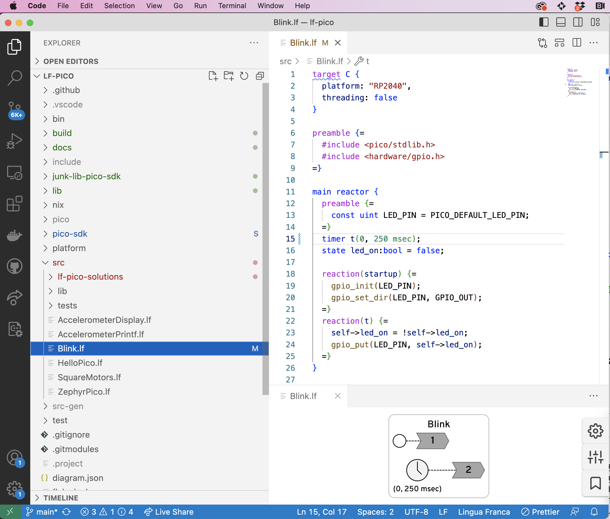

# 1. Tools and Environments
The purpose of this lab exercise is to familiarize you with the hardware and software used for embedded software programming. This lab exercise assumes you have followed the [Installation instructions](./Installation.md).  The [Resources](./Resources.md) and [Acronyms](./Acronyms.md) pages will also prove particularly useful.

Embedded systems often have limited resources and interaction methods and hence require a different approach for programming.
Their microprocessors often have no operating system, and are therefore called "bare metal" or "bare iron" machines.
They often have no keyboard or display connected to them, which can make debugging your programs challenging.
And they often have limited networking capability.
These lab exercises will help you develop the capability to build sophisticated programs for such embedded systems.

In this lab exercise, you will learn to interact with a particular microcontroller, a [Raspberry Pi RP2040](https://en.wikipedia.org/wiki/RP2040)
on the [Pololu 3pi+ 2040 robot](https://www.pololu.com/docs/0J86). 
The RP2040 microcontroller is a low cost dual-core chip designed by the [Raspberry Pi Foundation](https://www.raspberrypi.org) in association with [Broadcom](https://www.broadcom.com).
Each core implements the [ARM Cortex-M0+](https://en.wikipedia.org/wiki/ARM_Cortex-M#Cortex-M0+) instruction set and is clocked at 133 MHz.
The same RP2040 microprocessor is also available on the low-cost [Raspberry Pi Pico board](https://en.wikipedia.org/wiki/Raspberry_Pi#Raspberry_Pi_Pico), but this board does not have the sensors and actuators of the Pololu robot, so you will need the robot to be able to complete all the exercises.
See the [Raspberry Pi Wikipedia page](https://en.wikipedia.org/wiki/Raspberry_Pi) for more background on this family of microcontrollers.

### Hardware

The [Pololu 3pi+ 2040 robot](https://www.pololu.com/docs/0J86) looks like this from the top and bottom:





The robot is designed to be extended with additional hardware.  The available electrical interfaces are shown below:


The pins GP24, GP27, GP28, and GP29 are free I/O pins that are not used for anything on the 3pi+ 2040. Each of these pins is accessible on the mid expansion header, and can be used as a general purpose input, digital output, or PWM output. Three of the pins (GP27, GP28, and GP29) can be used as analog inputs.

### Software

The robot can be programmed in Python (using [MicroPython](https://micropython.org)) or in C. In these lab exercises, we will be programming in C to gain more direct experience with the boundary between software and hardware. The robot runs no operating system, so when you load a C program onto it, that is the only software running.

As is typical in embedded software development, the software you will write will depend on one or more layers of toolkits provided by the various companies involved in the product:

1. The lowest level is the [ARM Cortex-M0+](https://en.wikipedia.org/wiki/ARM_Cortex-M#Cortex-M0+) instruction set, which you will not use directly in these labs. To use it directly, you would write your code in the ARMv6 assembly language.
2. The next level is to use the C language together with a [cross compiler](https://developer.arm.com/downloads/-/arm-gnu-toolchain-downloads) provided by ARM, Ltd. A cross compiler is a compiler that runs on a host machine (a Windows, Mac, or Linux machine) and produces machine code to be loaded onto the microcontroller.  Writing programs in C is much easier than in assembly language.
3. The [Raspberry Pi Pico SDK](https://www.raspberrypi.com/documentation/pico-sdk/) is a collection of C functions designed for use with the RP2040 on the Pico board. Although the robot is not identical to the Pico board, many of these C functions work unchanged with the robot.  Moreover, the develpment toolchain we will use is the same (cmake for building and picotool for loading onto the processor).
4. The [Robot library](https://github.com/pololu/pololu-3pi-2040-robot/tree/master/c) provided by Pololu provides additional C functions that are customized to the particular board design on the robot. These functions provide convenient interfaces to the various sensors and actuators on the robot.
5. [Lingua Franca](https://lf-lang.org) is a coordination language for designing and composing software components.  In these lab exercises, we will use its [C target](https://www.lf-lang.org/docs/handbook/target-language-details?target=c) and a small library of pre-defined components called **reactors** that offer convenient access to certain robot features and examples on which you can base your own code.
6. [CMake](https://en.wikipedia.org/wiki/CMake) is a build tool that manages dependencies. Nearly any program you build will depend on other programs and libraries and maintaining these dependencies can be very tedious. CMake supports encoding the dependencies in a way that makes it more likely that your code will compile even when put on a different computer or with a different filesystem organization.

### Development Tools

For developing C and Lingua Franca programs, we recommend using [Visual Studio Code](https://en.wikipedia.org/wiki/Visual_Studio_Code) (**VS Code**), an integrated development environment (**IDE**) from Microsoft.
Three VS Code extensions will prove particularly useful, the [C/C++ extension](https://marketplace.visualstudio.com/items?itemName=ms-vscode.cpptools), the
[Lingua Franca extension](https://www.lf-lang.org/docs/handbook/code-extension), and
[CMake Tools](https://marketplace.visualstudio.com/items?itemName=ms-vscode.cmake-tools),
all available from the [Visual Studio Marketplace](https://marketplace.visualstudio.com).
The VS Code extension for Lingua Franca has a particularly useful feature where it automatically generates a diagram showing the structure of your program, as shown below:


## 1.1 Prelab

These exercises are intended to make sure you are up-to-speed on using the Unix command line.  See [Resources](./Resources.md) for some pointers.

1. What flag for `ls` displays all files, even hidden ones?
2. How do you move to the parent directory of the current one?
3. What is the difference between the `mv` and `cp` commands?
4. What does the `-h` flag of `ls` do? **Hint:** use `man` to find out.
5. In a git repository, what command displays whether there are any local changes and what they are?
6. In a git repository, what does `git pull` do?

## 1.2 A First C Program

First, check your installation has been done correctly. One of the side effects of the installation is to define an environment variable called `PICO_SDK_PATH` that points to the root location of the RPi-Pico SDK. Check it:

```
$ echo $PICO_SDK_PATH
/Users/eal/git/lf-pico/pico/pico-sdk
```

You may wish to look at the README file in that directory.
We will now compile and load an example C program onto the robot.
We do this two different ways, using the command line and using an IDE.

### Using the Command Line

First, find the pico-examples directory and make it your current working directory:

```bash
   cd lf-pico/pico/pico-examples
```

(**NOTE:** `lf-pico` here and everywhere that follows is the location of your clone of the [lf-pico repository](https://github.com/lf-lang/lf-pico)).

Make a blank `build` directory and use it to compile all the examples:

```bash
    mkdir build
    cd build
    cmake ../
    make
```

This should result in a rather lengthy output.
When it finally finishes, each of the subdirectories of the `build` directory will contain binary files that you can load onto the robot.

Connect the robot to the USB port of your host computer.
Before flashing the binary to your RP2040 based board, the board must be placed into ``BOOTSEL`` mode.  On the Pololu 3Pi+ robot, hold the `B` button and press `RESET`.
(On a Raspberry Pi Pico, hold the `RESET` button while connecting the board to the host.)
You can then use the `picotool` to load and execute one of the sample programs:


```
    picotool load -x blink/blink.elf
```

The `-x` option directs the robot to execute the code after loading it.
This will result in an LED blinking on the robot.
The loaded code will persist on the robot until the next time it is put in `BOOTSEL` mode and loaded with a new program.
You can disconnect the robot and use the power button to start it running on battery power.

### Using VS Code

Next we will repeat the exercise, but this time using VS Code rather than the command line to compile the code.
Under the hood, VS Code uses the CMake Tools extension to achieve the same process.

Start VS Code in your root lf-pico directory:

```
   $ cd lf-pico/pico/pico-examples
   $ code .
```

This will likely result in a popup appearing as follows:



You should select the arm-none-eabi kit. If you do not see one, select "Scan for kits". It you do not see the popup above, click on "No kit selected" on bottom blue bar.  **NOTE:** You may need to make sure that CMake Tools is the Configuration Provider. Select View->Command Palette in the menu and begin typing "C/C++ Change Configuration Provider" until you see this:


If CMake Tools is not available, then the cmake extension is not installed in VS Code.

If all goes well, VS Code will have compiled all the examples, and you see output something like this:



VS Code has run CMake, but it has not yet compiled the example programs.
To compile them, click on the "Build" button in the blue bar at the bottom.
If you run the build on the command line as above, then this time it should not take too long.

When you see "Build finished with exit code 0," then you can load the code onto the robot using picotool.  To do this from within VS Code, select the Terminal tab in the Output subwindow and issue the load command as above:

```
    picotool load -x build/blink/blink.elf
```

Make sure the robot is in `BOOTSEL` mode before doing this.

### Examining the C Program

Find and examine the C program `blink.c`. How is it controlling the timing of the blinking of the LED?

**Checkoff:** Verify that the VS Code and command-line mechanisms are working.
Explain how the timing of the blinking of the LED is controlled.


## 1.3 A First Lingua Franca Program

Start code in the root `lf-pico` directory:

```
    cd lf_pico
    code .
```

Open and examine the `Blink.lf` program in the `src` directory.  You may want to open the diagram and drag its subwindow to the bottom so that you something like this:



To compile this program, select View->Terminal from the menu, and type in the terminal (or an external terminal window if you prefer),

```
    lfc src/Blink.lf
```

Connect your robot in `BOOTSEL` mode and load and execute the program:

```
    picotool load -x bin/Blink.eld
```

You should see same blinking LED as before.

Now, examine the LF program. How is the timing of the LED controlled here?  You may want to consult the [Lingua Franca documentation for timers](https://www.lf-lang.org/docs/handbook/time-and-timers?target=c#timers).
Modify the Blink.lf program to use two timers, one that turns on the LED and one that turns it off, eliminating the state variable `led_on`.

**Checkoff:** Show your modified LF program. Explain how this use of timers is different from the sleep function used in the C code `blink.c`.

## 1.4 Printing Output

As is typical of embedded platforms, the Pololu robot does not normally have a terminal connected to it.  The LEDs and small LCD display can be used to get information about the running program, but often, particularly while debugging, it is convenient to be able to simply insert `printf` statements into your programs to see what is going on.

Your first task here is to modify your previous LED blinker to print "ON" and "OFF" each time it turns on or off the LED.  If you run the program as above, however, where do these printed statements go?

The C function `printf` sends textual data to a conceptual device called **stdout** (for "standard output").
By default, the robot is configured to direct all stdout text to a serial port on its USB interface.
The trick, therefore, is to get your host computer to connect to that serial port and display data that arrives from the robot.

To do that, we a terminal emulator called **screen**.  But first, we have to identify the serial port device that was created when the program started up.
A simple way to do that is to look in the `/dev/` directory on your computer for a device that includes "usb" in its name:

```
    ls /dev/*usb*
```

On my machine, this lists two:

```
    /dev/cu.usbmodem14201	/dev/tty.usbmodem14201
```

To use screen, we specify the first of these devices and a baud rate, as follows:

```
    screen /dev/cu.usbmodem14201 115200
```

You should now see the printed outputs.
You can return terminal to normal mode by **detaching** screen by typing Control-A d.
You can reattach with

```
    screen -r
```

To permanently end screen, type Control-A k (for kill).

**Checkoff:** Show ON-OFF output.    

## 1.5 Modular Reusable Reactors

The LED code in `Blink.lf` is in a main reactor, which cannot be imported into any other Lingua Franca application.
Your next task is to create reusable reactor called \code{LED} that has a single input named \code{set} with type `bool`.
When the reactor receives an input event with value `true`, it should turn on the LED.
When it receives an input with value `false`, it should turn off the LED.

To do this, create a file in your `src/lib` directory called `LED.lf` with the following structure:

```
target C {
  platform: "RP2040",
  threading: false
}
preamble {=
  #include <hardware/gpio.h>
=}
reactor LED {
  input set:bool;
    
  reaction(startup) {=
    // Fill in your code here
  =}

  reaction(set) {=
    // Fill in your code here
  =}
}
```

Then create a new LF file that imports this reactor and drives its input in such a way as to blink the LED.  The following LF documentation could prove useful:

- [Inputs and Outputs](https://www.lf-lang.org/docs/handbook/inputs-and-outputs?target=c)
- [Composing Reactors](https://www.lf-lang.org/docs/handbook/composing-reactors?target=c)
- [Reactions and Methods](https://www.lf-lang.org/docs/handbook/reactions-and-methods?target=c)

You have probably noticed some patterns here. E.g., each LF file begins with this:

```
target C {
  platform: "RP2040",
  threading: false
}
```

This specifies that the target language is C, so the `lfc` compiler generates C programs. The platform specification indicates that the C runtime system for the Raspberry Pi 2040 should be used.  The `threading` directive indicates that the target is bare metal machine with no operating system and no thread library.

To initialize and toggle the LED, we are using library functions like `gpio_put` which are declared in a header file `gpio.h` that is part of the standard Pico SDK.
Inclusion of this header file is a consequence of this directive:

```
preamble {=
  #include <hardware/gpio.h>
=}
```

What happens if you omit this?

For documentation about this header file, see the [Pico SDK documentation](https://www.raspberrypi.com/documentation/pico-sdk/), and specifically the [hardware_gpio section](https://www.raspberrypi.com/documentation/pico-sdk/hardware.html#hardware_gpio).
These functions manipulate memory-mapped registers that control the GPIO pins of the processor.
On the robot, one of those pins, identified in the header files by the `PICO_DEFAULT_LED_PIN` macro, controls the LED you see blinking.
Subsequent labs will explore more deeply the use memory-mapped registers for I/O.

**Checkoff:** Show the diagram for your program.


## Postlab Questions

1. What format specifier(s) for `printf` allows the printing of floats (there may be several)?
  
2. When might `printf` statements be the best tool for debugging? 

3. What other tools might be useful for debugging embedded software (note that using an interactive debugger like `gdb` with the robot or pico board [requires extra hardware](./Debugger.md))? 

4. What does the volatile keyword mean in C? \points{3}    

5. What were your takeaways from the lab? What did you learn during the lab? Did any results in the lab surprise you?
