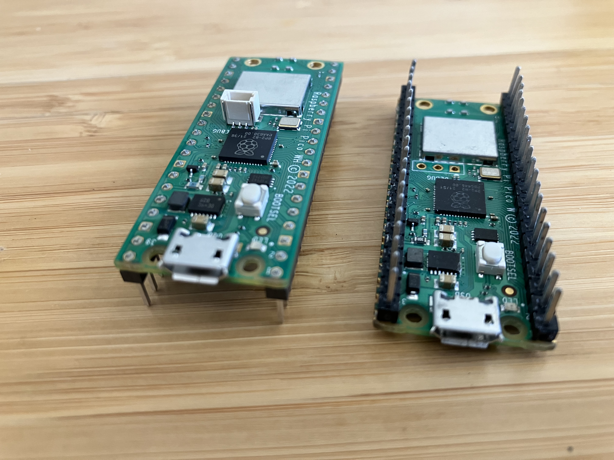
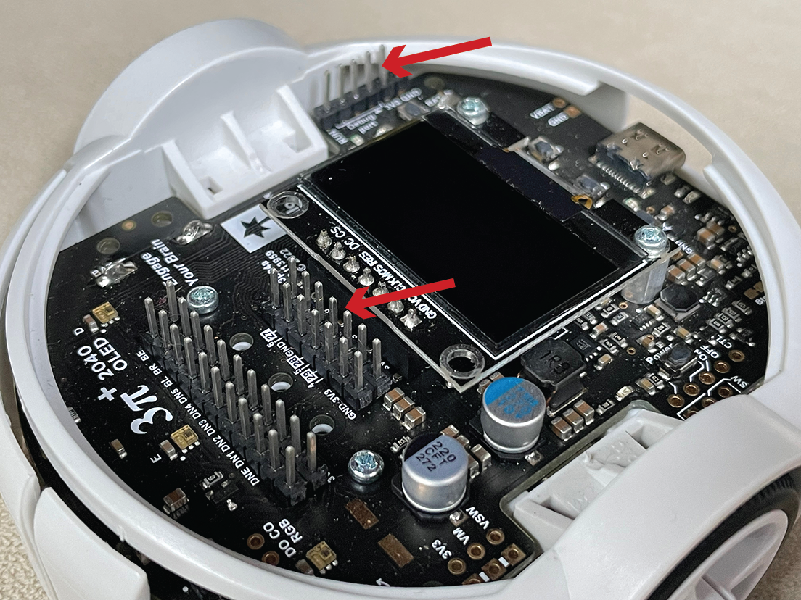
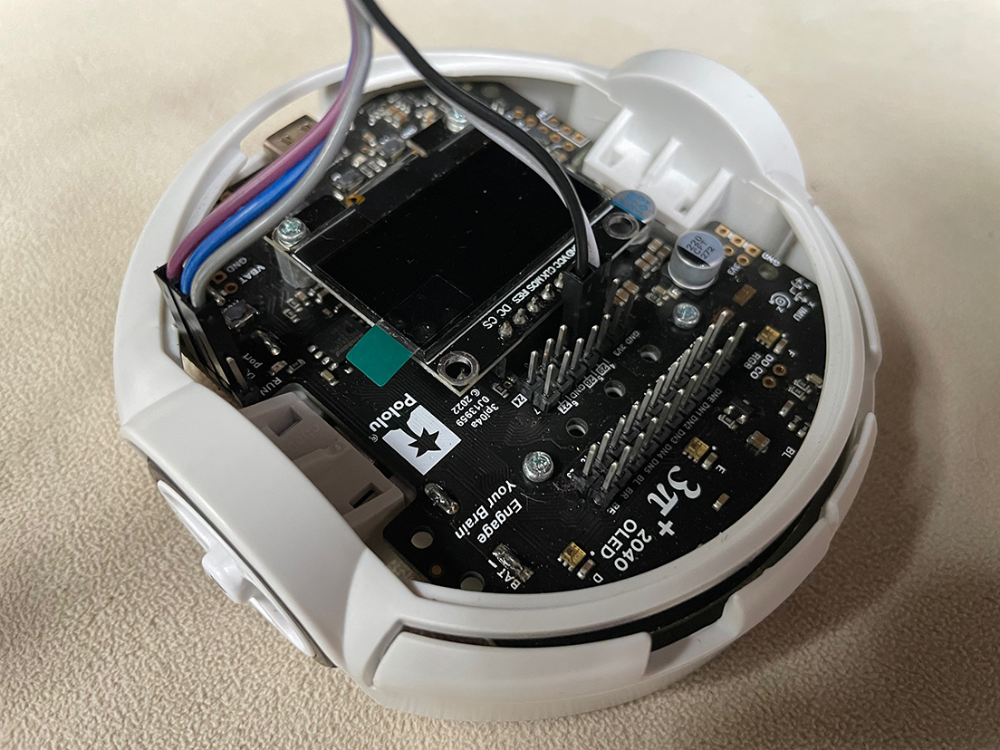
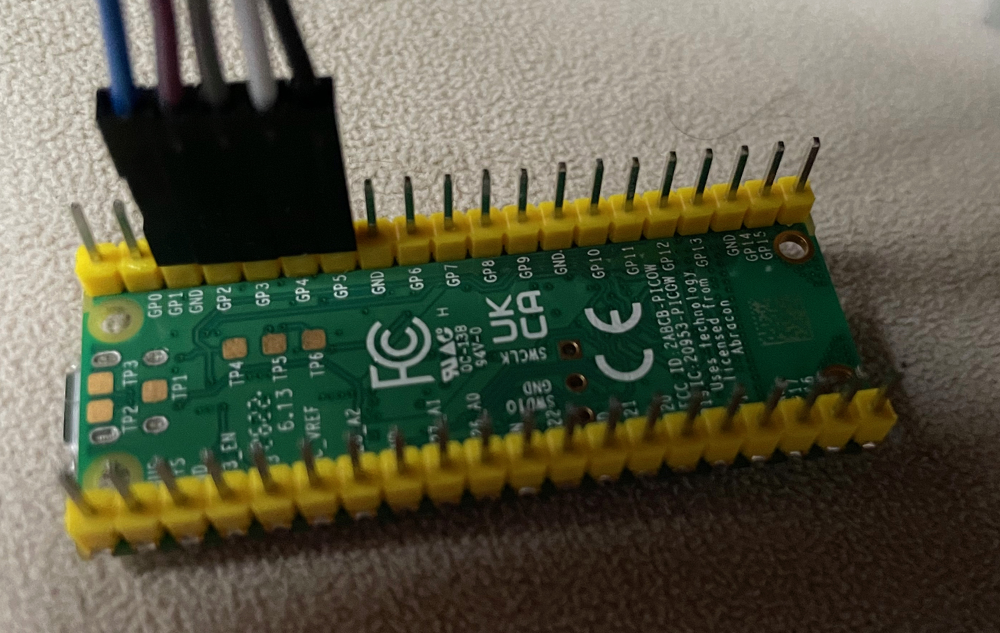
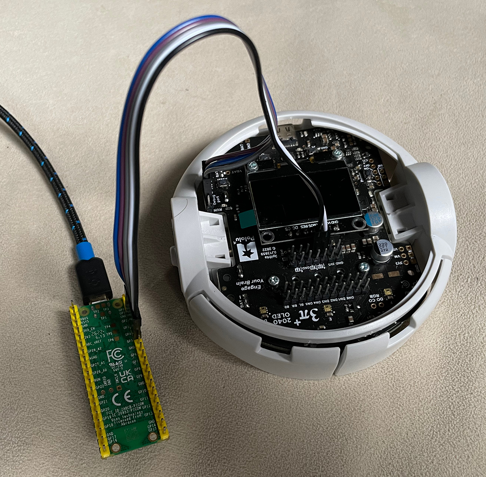
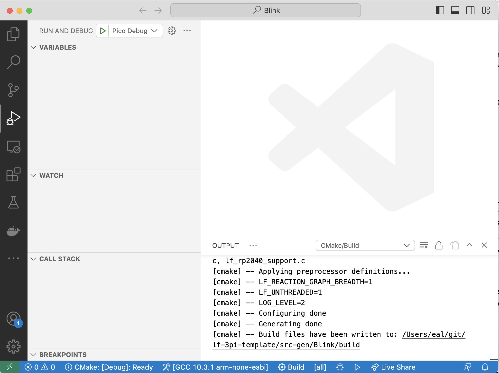
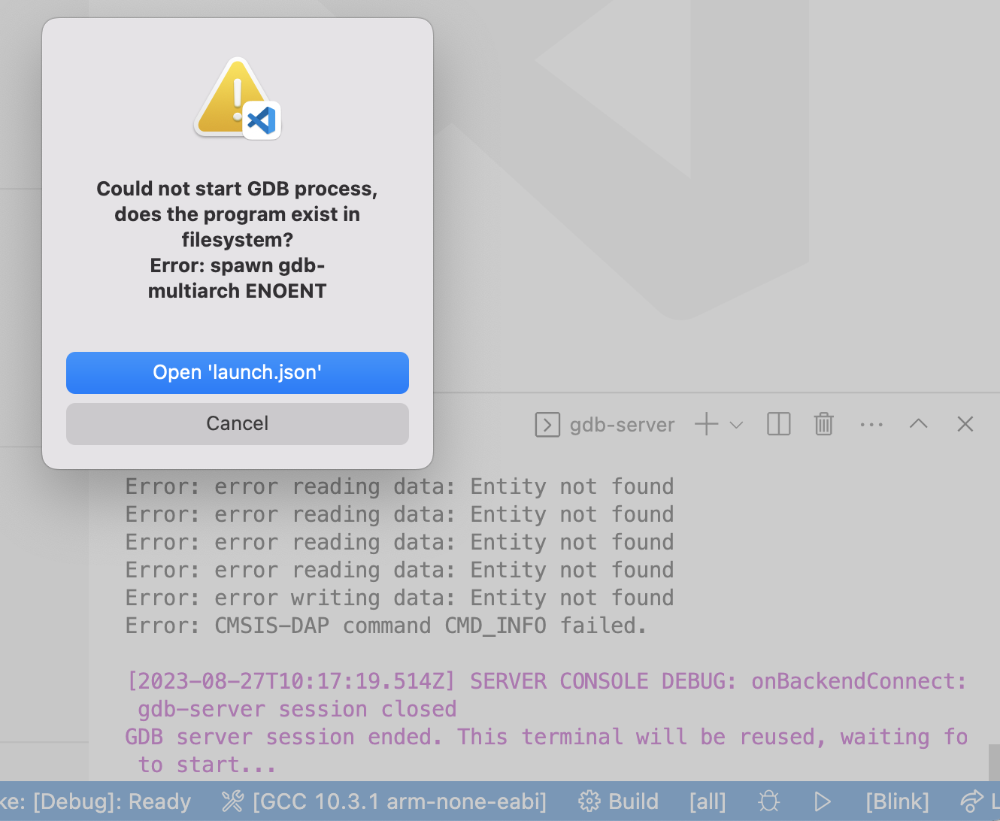

# Using a Debugger

## Debugging

Interactive debugging, using for example `gdb`, is where you set breakpoints in your program, can step through the program line-by-line, and can examine variable values while the program is running.  It allows far greater visibility than what you can achieve by just inserting print statements into your program. However, it is considerably more challenging to get interactive debugging working on an embedded device such as the RP2040 on the Pololu robot than on a program running on your host computer. Here, we explain how this can be accomplished, but it requires wiring a secondary embedded device, a Raspberry Pi Pico, to the Pololu robot and then connecting your host computer to the secondary Pico using its Micro USB interface.
The secondary Pico looks like this:



## Requirements

Detailed instructions can be found in Appendix A of the [Getting Started with Raspberry Pi Pico](https://datasheets.raspberrypi.com/pico/getting-started-with-pico.pdf) document.

You will need the following hardware:

- A [Raspberry Pi Pico](https://www.raspberrypi.com/products/raspberry-pi-pico/)
- A Micro USB cable
- Female to female jumper cables (5)

Software that you will need:

- [picoprobe](https://github.com/raspberrypi/picoprobe), which runs on the Pico.
- [openocd](https://openocd.org/), which runs on the host computer.

Your favorite package manager may work to install the on-chip debugger software, openocd, on your host computer. E.g., on a Mac,

```bash
$ brew install openocd
```

Detailed instructions for installing from source on various platforms can be found in  Appendix A of the [Getting Started with Raspberry Pi Pico](https://datasheets.raspberrypi.com/pico/getting-started-with-pico.pdf) document.

### Picoprobe

The first step is connect the Pico to your computer using the Micro USB cable while holding the `BOOTSEL` button.  The Pico should appear like an external disk on your computer. You can now install applications on it using `picotool`, just as you installed LF programs on the robot.  **NOTE:** If the Pico does not appear as an external disk, it is possible that your Micro USB cable is of the wrong type. Sadly, it is common for Micro USB cables to only include the wires that supply power, not the wires needed for transferring data. The manufacturers probably saved a few micropennies.

The particular application you will need on the Pico is [picoprobe](https://github.com/raspberrypi/picoprobe). This application allows a Raspberry Pi Pico to act as a [cmsis-dap](https://arm-software.github.io/CMSIS_5/DAP/html/index.html) device which interacts with the target RP2040 on the robot through a [serial wire debug](https://wiki.segger.com/SWD) (SWD) interface connection.  Dowload the [picoprobe.elf file](https://github.com/raspberrypi/picoprobe/releases/tag/picoprobe-cmsis-v1.02) (or the picoprobe.uf2).  Then, with your Pico in `BOOTSEL` mode, upload the file:

```bash
$ picotool load picoprobe.elf
```

Now, your Pico is ready to serve as a debugging bridge.

### Wiring

Once the **probe** device (the Pico) is prepared, wire it up to the **target** device (the robot) as follows:

```
Probe GND -> Target GND
Probe GP2 -> Target SWCLK
Probe GP3 -> Target SWDIO
Probe GP4 (UART1 TX) -> Target GP1 (UART0 RX)
Probe GP5 (UART1 RX) -> Target GP0 (UART0 TX)
```

The last two wires connect the probe to *UART0*, which by default carries standard I/O and hence should make visible any `printf` outputs from your program through the probe.
You should be able to see this output using `screen` as explained in the [Tools](Tools.md) lab.

To make these connections, if you bought the robot assembled, then it likely came without expansion headers, so you will need to solder headers onto your robot so that it looks like this:



The particular pins on the robot headers that you need are labeled within the circles below:


With wires attached, it should look like this:



The wires needed on the Pico are these:



Complete wiring looks like this:



**NOTE:** The wiring connects the ground of the Pico to the ground of the robot, but there is no power connection to the robot. You will need to power the robot using its own batteries.

### Debug Symbols

For a debugger to be able to meaningfully interact with an executing program, it is necessary for the binary `.elf` file that you flash onto the robot to include debug symbols.
This means that a symbol table is included in the binary that tells the debugger where in memory functions and variables are located.
For a Lingua Franca program to include such debug symbols, the **target** directive needs to include a `build-type` field set to `debug`, as follows:

```lf
target C {
  platform: {
    name: "rp2040",
    board: "pololu_3pi_2040_robot"
  },
  single-threaded: true,
  build-type: debug
}
```

To test this, modify `src/Blink.lf` to include the `build-type` field and compile the program:

```shell
lfc src/Blink.lf
```

This will create a file `bin/Blink.elf` that includes debug symbols.

### OpenOCD

[Open On-Chip Debugger](https://openocd.org/) is a program that runs on your host machine. It is a `debug translator` that understands the SWD protocol and is able to communicate with the probe device while exposing a local debug server for a debugger to attach to.

After wiring, run the following command to flash a `Blink.elf` binary with debug symbols onto the robot:

```
openocd -f interface/cmsis-dap.cfg -c "adapter speed 5000" -f target/rp2040.cfg \
    -c "program bin/Blink.elf verify reset exit"
```
The above will specify the 

- probe type: `cmsis-dap`
- the target type: `rp2040`
- commands: the `-c` flag will directly run open ocd commands used to configure the flash operation. 
	- `adapter speed 5000` makes the transaction faster.
	- `program <binary>.elf` specifies the `elf` binary to load into flash memory. 
	- `verify` reads the flash and checks against the binary.
	- `reset` resets and starts executing the program.
	- `exit` disconnects openocd.

When this is finished, the LED on the robot should be blinking.

### GDB

The gnu debugger `gdb` is an open-source program for stepping through application code. Here we use the remote target feature to connect to the exposed debug server provided by openocd. 

First restart openocd using the following command:

```bash
openocd -f interface/cmsis-dap.cfg -c "adapter speed 5000" -f target/rp2040.cfg -s tcl
```

Included in the output from the above command should be something like this:

```
Info : starting gdb server for rp2040.core0 on 3333
Info : Listening on port 3333 for gdb connections
Info : starting gdb server for rp2040.core1 on 3334
Info : Listening on port 3334 for gdb connections
```

In a separate terminal window, run the following `gdb` session specifying the `.elf` binary. Since this binary was built using the `debug` directive, it will include a symbol table that will be used for setting up breakpoints in `gdb`.

```bash
gdb bin/Blink.elf
```
Once the GDB environment is opened, connect to the debug server using the following. Each of the two cores exposes its own port.
With `single-threaded` set to `true` in the target directive, `core0` runs the main thread, so you want to connect gdb to port `3333`:

```bash
(gdb) target extended-remote localhost:3333
```

This will connect gdb to the executing program and stop the program at whatever point it happens to be running.
You will see output something like this:

```
Remote debugging using localhost:3333
alarm_pool_get_default () at /Users/eal/git/lf-3pi-template/pico-sdk/src/common/pico_time/time.c:93
93	alarm_pool_t *alarm_pool_get_default() {
```

This means that the program halted at line 93 of a Pico SDK file called `time.c`.
The LED should no longer be blinking.

From this point on, normal gdb functionality such as breakpoints, stack traces, and register analysis can be accessed through various gdb commands.
A [gdb tutorial](https://www.tutorialspoint.com/gnu_debugger/index.htm) might be helpful at this point.

To set a breakpoint at a Lingua Franca reaction, and relatively easy way to to that is to find the function name for the function generated by `lfc` for the reaction.
For the Blink program, you can examine the generated code using VS Code:

```
code src-gen/Blink/
```

In the file `_blink_main.c`, there are two functions, `_blink_mainreaction_function_0` and `_blink_mainreaction_function_1`.
These correspond to the two reactions in `Blink.lf`, where the main reactor is this:

```
main reactor {
  timer t(0, 250 ms);
  state led_on:bool = false;

  reaction(startup) {=
    gpio_init(PICO_DEFAULT_LED_PIN);
    gpio_set_dir(PICO_DEFAULT_LED_PIN, GPIO_OUT);
  =}
  reaction(t) {=
    self->led_on = !self->led_on; 
    gpio_put(PICO_DEFAULT_LED_PIN, !self->led_on);
  =}
}
```

In gdb, you can set a breakpoint at the second of these reactions, examine the stack, print variable values, etc. For example, here is an interactive session:

```
(gdb) break _blink_mainreaction_function_1
Breakpoint 1 at 0x10000304: file /Users/eal/git/lf-3pi-template/src/Blink.lf, line 26.
Note: automatically using hardware breakpoints for read-only addresses.
(gdb) continue
Continuing.

Breakpoint 1, _blink_mainreaction_function_1 (instance_args=0x200028f8) at /Users/eal/git/lf-3pi-template/src/Blink.lf:26
26	    self->led_on = !self->led_on; 
(gdb) print self
$1 = (_blink_main_main_self_t *) 0x200028f8
(gdb) print self->led_on
$2 = false
(gdb) next
27	    gpio_put(PICO_DEFAULT_LED_PIN, !self->led_on);
(gdb) print self->led_on
$3 = true
(gdb) next
_lf_invoke_reaction (env=env@entry=0x200018d0 <envs>, reaction=reaction@entry=0x20002970, worker=worker@entry=0)
    at /Users/eal/git/lf-3pi-template/src-gen/Blink/core/reactor_common.c:1351
1351	    ((self_base_t*) reaction->self)->executing_reaction = NULL;
(gdb)
```

At this point, the LED should have gone from off to on (or on to off, depending on its state when you connected gdb).

### Visual Studio Code

Breakpoints can be placed in generated lingua franca project source code within **vscode**. 
As a part of the code generation process, each lfc generates a ``.vscode`` directory in the program ``src-gen`` folder. 
This is populated with settings to configure and run ``gdb``, ``openocd`` and ``cmake``.

Run the following after generating code for the desired lf program:

```bash
$ code src-gen/Blink/
```

In vscode, navigate to the run and debug tab on the left. A **Pico Debug** option should appear at the top as shown here:



First, you will need for VS Code to build the project.  Clean up from the previous `lfc` builds as follows:

```bash
rm -rf src-gen/Blink/build
```

Then click on the blue `Build` button at the bottom of the VS Code window.

Make sure the *picoprobe* is connected and wired as noted above and click run (the green triangle). The debugger should automatically break
at the ``main`` method of the application. Breakpoints can be visually inserted and other debugger options are accessible through
the IDE gui.

**Troubleshooting:** Depending on the platform you are running on and how `gdb` was installed, you may see the following error when try to run the program:



Click on `Open 'launch.json'` and edit this line:

```
            "gdbPath" : "gdb-multiarch",
```

This line specifies the `gdb` program to use.  It may be simply:

```
            "gdbPath" : "gdb",
```


