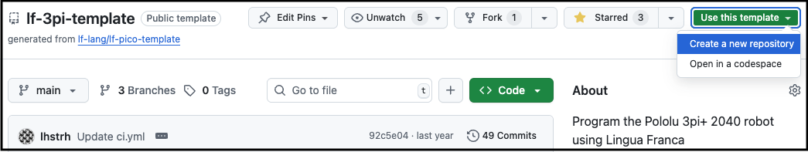
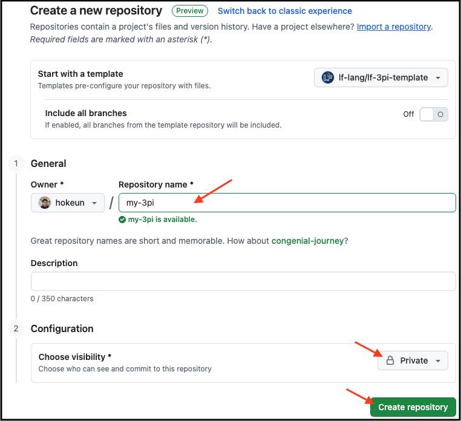

# Getting Started

Before getting started, please make sure you have satisfied all the [prerequisites](Prerequisites.html).

## Set up GitHub account and SSH key
If you do not yet have a GitHub account, [create one](https://github.com/signup).

### Set up authentication with GitHub
If you haven't already, set up authentication with GitHub. The recommended way of doing this is using `gh`, the GitHub CLI tool. Run the following command:

```bash
$ gh auth login
```
Then select `> GitHub.com` and `HTTPS` if you prefer to authenticate via HTTPS, or `SSH` if you prefer to authenticate via SSH. The former uses a token and the latter uses a public/private key pair that it installs as part of the login procedure. After agreeing to authenticate Git with your GitHub credentials, select `Login with a web browser`, copy the one-time code printed on the command prompt, and press <kbd>Enter</kbd>. You will then be taken to [github.com](https://github.com/login/device) in your browser. After entering your credentials and pasting the one-time code, authentication will be completed.

## Create your repository
Start by creating a new private repository on GitHub based on the [lf-3pi-template](https://github.com/lf-lang/lf-3pi-template) repository, which provides a starting point for students to carry out the exercises in this lab and to develop further applications using the [Raspberry Pi Pico board](https://www.raspberrypi.com/products/raspberry-pi-pico/) and the [Pololu 3pi+ 2040 robot](https://www.pololu.com/docs/0J86).

Navigate to the [lf-3pi-template](https://github.com/lf-lang/lf-3pi-template) repository.  Select "Use this template" and "Create a new repository", as shown here:



Give your repo a name and click on "Create repository":



## Clone your repository
On the command line on your host machine, change directory to the location where you would like to check out your repository. Let us assume that you named your repo `my-3pi`. Check it out using the following command (where `<username>` must be substituted with your GitHub username):

```bash
$ gh repo clone <username>/<reponame>
```

This will create a directory called `my-3pi` in the current working directory.

The template includes [raspberrypi/pico-sdk](https://github.com/raspberrypi/pico-sdk) as a submodule, which itself also has a lot of submodules. We recommend against using the `--recursive` flag because we do not need to recursively clone the submodules inside of `pico-sdk`. Instead, change directory into the root of your clone and run:

```bash
$ git submodule update --init
```

If  `pico-sdk` was checked out correctly running `git submodule` in the root of the repository will show the hash _without_ a `-` preceding it,
e.g.: `6a7db34ff63345a7badec79ebea3aaef1712f374 pico-sdk (1.5.1)`.

> **_Note for existing GitHub users_**
>
> If you are an existing GitHub user and have already set up a public/private key pair (or have done so by selecting `SSH` as the protocol when running `gh auth login`), you can also clone the repo as follows:
> ```
> $ git clone git@github.com/<username>/<reponame>.git
> ```

## Configure Nix

> **_Note for VM users_**
>
> If you are using the [VM image](https://vm.lf-lang.org/), you can skip this step. You will never have to invoke `nix` and can ignore any reminders about doing this.

To create a reproducible unix shell environment that installs all required dependency applications, we use the [nix](https://nixos.org) package manager, which has support for Linux, macOS, and Windows (via WSL). See [prerequisites](Prerequisites.html) for installation instructions. If you prefer to manage dependencies yourself and not rely on `nix`, follow the [instructions for a non-`nix` setup](Non-Nix.html).

After installation, run the following in the shell to enable the experimental nix flakes feature, which helps to create more consistent builds:

```bash
$ mkdir -p ~/.config/nix
$ echo "experimental-features = nix-command flakes" >> ~/.config/nix/nix.conf
```

To install the dependencies, run the following in the root of your repository:

```bash
$ nix develop
```

This should automatically download and install specific revisions of the `gcc-arm` toolchain, `openocd`, and `picotool`. These packages will be required compiling, flashing and debugging C code for the RP2040.
(You can alternatively manually [install the Raspberry Pi Pico Tools](Non-Nix.html#install-picotool).)

If you hit any error while running `nix develop`, see troubleshooting instructions below.

> **_Troubleshooting (Linux/WSL)_**
>
> You may see an error message like this when running the `nix develop` command:
> ```bash
> error:
>       … while fetching the input 'git+file:///home/osboxes/lf-lang/my-3pi'
> error:
>       cannot connect to socket at '/nix/var/nix/daemon-socket/socket': Permission denied
>
> ```
> This means that your user is not a member of the `nix-users` group. To fix this, see [prerequisites](Prerequisites.html#using-nix-on-linuxwsl).

> **_Troubleshooting (ARM/Apple Silicon Mac)_**
>
> As of August 1, 2023, the stable version of nix does *not* support ARM/Apple Silicon Macs. You may see an error message like this when running the `nix develop` command:
> ```
> is not available on the requested hostPlatform
> ```
> You can work around this issue by setting up an environmental variable and running the nix command with an additional argument, `--impure`, like this:
> ```bash
> $ export NIXPKGS_ALLOW_UNSUPPORTED_SYSTEM=1
> $ nix develop --impure
> ```
