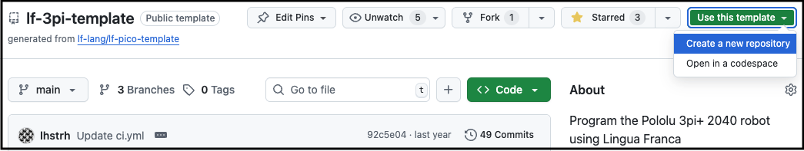
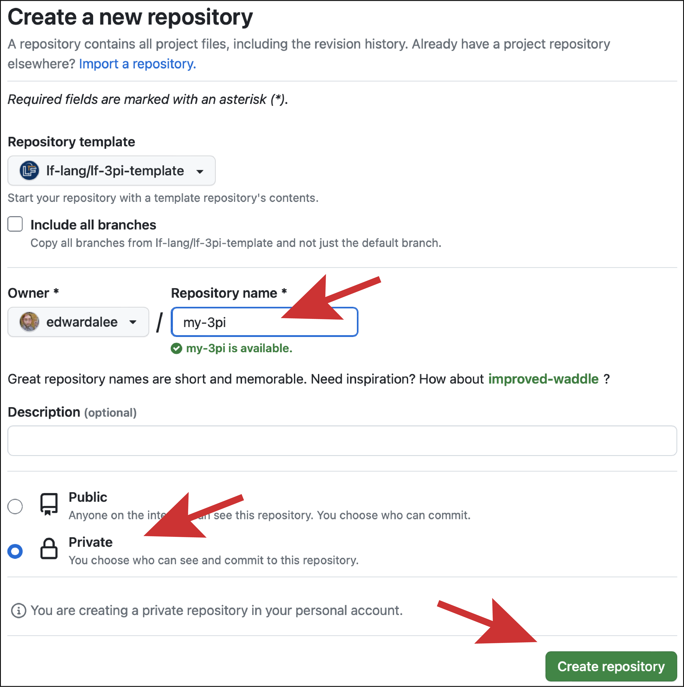

# Getting Started at Berkeley

For students in EECS 149/249A at UC Berkeley, the lab infrastructure provides a Docker container that is preconfigured with all the required software, so the [Prerequisites](Prerequisites.md) and [GettingStarted](GettingStarted.md) instructions are different. Please follow the instructions below.

Steps 1 and 2 can be done on your own machines. Please log on to 
the instructional machines from Step 3 onwards. 

## 1. Set up GitHub account and SSH key
If you do not yet have a GitHub account, [create one](https://github.com/signup). 
This can be done on your personal machine

## 2. Create your repository + Instructional Account

### 2.1 GitHub repo
This section can also be done on your own machine. Start by creating a new private repository on GitHub based on the [lf-3pi-template](https://github.com/lf-lang/lf-3pi-template) repository, which provides a starting point for students to carry out the exercises in this lab and to develop further applications using the [Raspberry Pi Pico board](https://www.raspberrypi.com/products/raspberry-pi-pico/) and the [Pololu 3pi+ 2040 robot](https://www.pololu.com/docs/0J86). 

Navigate to the [lf-3pi-template](https://github.com/lf-lang/lf-3pi-template) repository.  Select "Use this template" and "Create a new repository", as shown here:



Give your repo a name and click on "Create repository":



### 2.2 Instructional Account
Visit https://acropolis.cs.berkeley.edu/~account/webacct/, log in with your CalNet ID and passphrase, and then sign up for an ee149 account. You will use this account on the computers in the lab.

## 3. Run the user setup (first login only)

Once you are in the lab, sign in to one of the EECS149 computers with your
new account (it'll be named something like `ee149-aaa`).  Open a terminal
window (there is a Terminal icon in the panel at the top of the screen).  Enter
the following two commands:

```bash
inst-containers-setup
~ee149/lab-user-setup.sh
```

This will install a number of Visual Studio Code extensions for you and create
the `lf-lab-box` container where you will do most of your work.

You only need to run these commands the first time you log in (though it's
harmless to run them again).

## 4. Start the container

The `lf-lab-box` container is **not running** when you log in. Open a terminal
**on the lab machine (host)** and run:

```bash
podman start lf-lab-box
```
---

## 5. Attach VS Code to the container
1. Launch **VS Code**.
2. Press `F1` → **Dev Containers: Attach to Running Container…**
3. Pick **`lf-lab-box`** in the list.
4. A new VS Code window opens. The bottom-left corner should read
   `Container lf-lab-box` in blue.
5. Open the integrated terminal with `` Ctrl+` ``. **This terminal is inside
   `lf-lab-box`** — every command in §4 and §5 is run here, not on the host.

VS Code prompts you to install the workspace's recommended extensions inside
the container — accept. The key one is:

- **Lingua Franca** (`lf-lang.vscode-lingua-franca`)

Optional but useful:

- **C/C++** (`ms-vscode.cpptools`)
- **CMake Tools** (`ms-vscode.cmake-tools`)

> If `lf-lab-box` does not appear in the Dev Containers picker, it is not
> running — go back to §2.
>
> The first attach to the container takes 10–20 seconds while VS Code
> installs a small server component into it.

---

## 6. Sign in to GitHub and clone your repo (inside the container)

Everything below runs in the **VS Code integrated terminal** opened in §3
(prompt should be inside `lf-lab-box`). Quick sanity check:

```bash
which lfc           # should print  /usr/local/bin/lfc
```

### 6.1 Sign in to GitHub

If you have not used `gh` on this machine before:

```bash
gh auth login
```

Choose:

- `GitHub.com`
- `HTTPS`
- `Login with a web browser`

Copy the one-time code shown, press Enter, paste it in the browser, sign in.

### 6.2 Configure your name + email for git

```bash
git config --global user.name  "Your Name"
git config --global user.email "you@berkeley.edu"
```

### 6.3 Clone your assignment repo

Use the repo name from §1:

```bash
cd ~
gh repo clone <link to your own repo created in section 2> my-3pi
cd my-3pi
git submodule update --init
cd pico-sdk
git submodule update --init```

The `my-3pi` directory name is just a friendly local name — pick anything.
The submodule step pulls in `pico-sdk`. Do **not** use `--recursive`, the
official guide explains why.

Sanity check:

```bash
git submodule
# expected: a hash WITHOUT a leading '-' next to pico-sdk, e.g.:
#   a1438dff... pico-sdk (2.2.0)
```

### 6.4 Open the folder in VS Code

In the same VS Code window (still attached to `lf-lab-box`):
**File → Open Folder…** → choose `~/my-3pi`. VS Code reloads with that folder
open, still inside the container.

---

## 7. Build and flash

> inside `lf-lab-box` and the Pico SDK is in your repo as a submodule.

### 7.1 Build a Lingua Franca program

In the VS Code integrated terminal (which is inside `lf-lab-box`):

```bash
lfc src/Blink.lf
```

Output: `bin/Blink.elf`.

You can also use the Lingua Franca extension's **Build** button (top-right
of the editor when viewing a `.lf` file).

### 7.2 Flash the Pololu 3pi+ 2040

1. Hold **BOOTSEL** (button that says "B") on the robot while plugging the USB cable in.
2. The robot appears as a USB drive named **`RPI-RP2`** on the desktop.
3. Either drag-and-drop the `.uf2` file onto it, or in the VS Code terminal:

   ```bash
   picotool load -x bin/Blink.elf
   ```

The robot reboots automatically and runs your program.

---

## 7. Daily workflow

```bash
# 1. Make sure the container is running:
podman start lf-lab-box                # no-op if already up
# 2. VS Code → F1 → Dev Containers: Attach to Running Container → lf-lab-box
# 3. Open your repo folder
# 4. In the integrated terminal:
git pull                              # if you collaborate
lfc src/Blink.lf                      # build
picotool load -x bin/Blink.elf        # flash (robot in BOOTSEL)
git add -A && git commit -m "..." && git push
```

---

## 8. Common issues

| Symptom | Fix |
|---|---|
| `lf-lab-box` is not in the Dev Containers list | The container is not running. In a host terminal: `podman start lf-lab-box`, then retry. |
| `lfc: command not found` | 1. You opened a terminal *outside* the container. Use VS Code's integrated terminal in the attached window, or `distrobox enter lf-lab-box`. OR 2. If you are in the container run nix develop in your git repo|
| `picotool: command not found` | Same — use the container terminal. |
| `gh: command not found` | Same — use the container terminal. |
| `git submodule update --init` is slow | Normal — `pico-sdk` is large. |
| `picotool: no accessible RP-series devices` | Robot is not in BOOTSEL — unplug, hold BOOTSEL, replug. |
| Robot doesn't show up as `RPI-RP2` | Try a different USB cable (some are charge-only). |
| `gh auth login` fails / can't open a browser | Use the SSH option, paste the public key into `github.com/settings/keys`. |
| open another folder in VSCode | In the VSCode terminal, `cd` into the target directory, and enter `code .` A new VSCode window should open and should automatically attach to the container

If something stays broken, ask a TA — **do not** install packages on the lab
machine yourself.

> If you are working **on your own laptop** instead of a lab machine, follow
> the upstream guide in full — `nix develop` and the rest are how you get
> the toolchain there.

---

Have fun!

<!--Now log on to the instructional machines using your instructional Unix account. And-->
<!--then follow everything from Step 3 of the README located at the bottom of -->
<!--[this repository](https://github.com/eecs149-249a/lingua_franca_lab_setup). -->
<!--Some parts to change and skip in the README:-->
<!--- Sections 1 and 2-->
<!--- The verification part of step 4-->
<!--- In Step 5, just open VSCode and skip the rest-->
<!--- In Step 6.3, the `gh repo clone` instruction should be cloning your own repo built from-->
<!--the lab template instead.-->
<!--- Ignore Section 9-->

