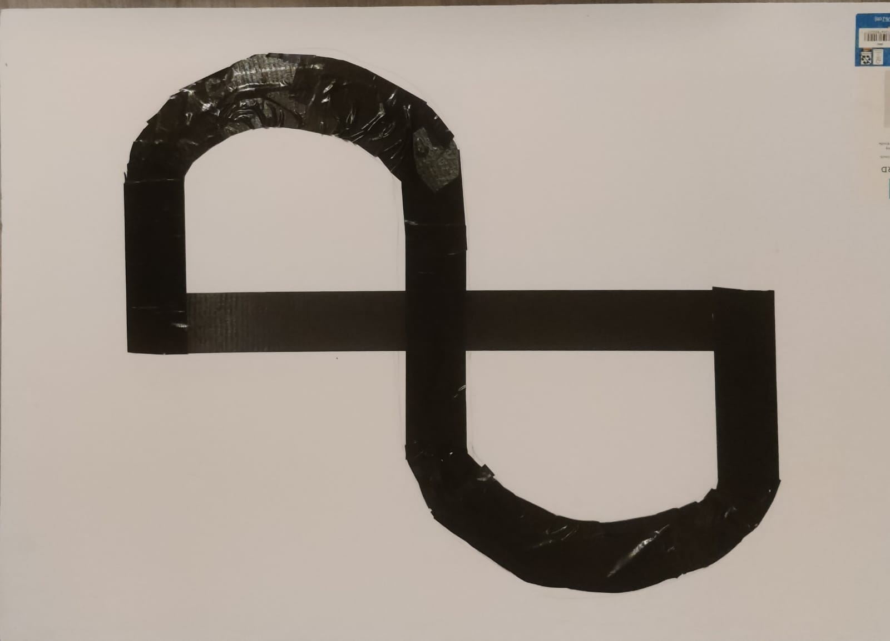

# 9 Line Following

The goal of this exercise is to program the Pololu robot in LF to perform line following, where the robot detects a line and follows it until it reaches the end.

For this lab, you will need a suitable line like the one here (made using black ducktape and a white foam board):

## 9.1 Prelab

<!---
NOTE: The prelabs may change according to the ordering of the lab.
-->

- Review [Section 6.5, Line and bump sensors](https://www.pololu.com/docs/0J86/6.5) of the [Pololu 3pi+ 2040 robot User's Guide](https://www.pololu.com/docs/0J86).

- Review the section for the motors from the previous lab. This lab will test how you adjust power to maneuver curves and sharp turns.

- Review [Line Sensing](./Hill.md#82-line-sensing), the same calibration should be done at the beginning of this excersie as well. However, there is a small difference in how the sensor is calibrated.
   For this lab, you are required to indicate where the robot is going to move as the sensor moves out of the line in order for the robot to realign itself with the track.
  
**Questions**

1. Can we use the gyroscope to make the robot navigate the curves?
2. Can we use the line sensors on the edges, i.e., sensor 1 and 5 to detect angles and curves? 

## 9.2 Line Following

**Checkoff:** Calibrate your line sensors to detect the "out-of-track" area.

Write LF code to make your robot follow the designated path. The trick is to make sure the robot's motor is calibrated perfectly to make the turns, adjust the speed of the robot.

**HINT:** 0.1f would be perfect to start, you may increase or decrease the speed eventually. The goal is functionality.

You may build a track at your own to test your code. The important thing to keep in mind is that the track must be smooth and the robot should not get stuck somewhere on the track. The track and the surroundings must have a significant contrast in color. You are free to test your code on that track before you submit the code. The robot should align itself without any external help even if it starts out skewed with respect to the track. The robot should stop at the end of the track or continue indefinitely if the track forms a loop. The robot should have enough intelligence or functionality to keep itself on track. The robot will be tested on a different track from the one you developed your code with, to ensure adaptability. Please put your solution in a file called `LineFollowSolution.lf`.

**Checkoff:** Show your robot driving to the end of the line and handling the curves smoothly.

## 9.3 Postlab

<!---
TODO(@the-systematic-chaos): Need to finalize solution code, the postlab questions will be based on the final solution.
-->

1. What were your takeaways from the lab? What did you learn during the lab? Did any results in the lab surprise you?
2. What method or logic did you use to tackle curves and sharp angles during the experiment?
3. Justify or explain the logic behind choosing that particular method.
